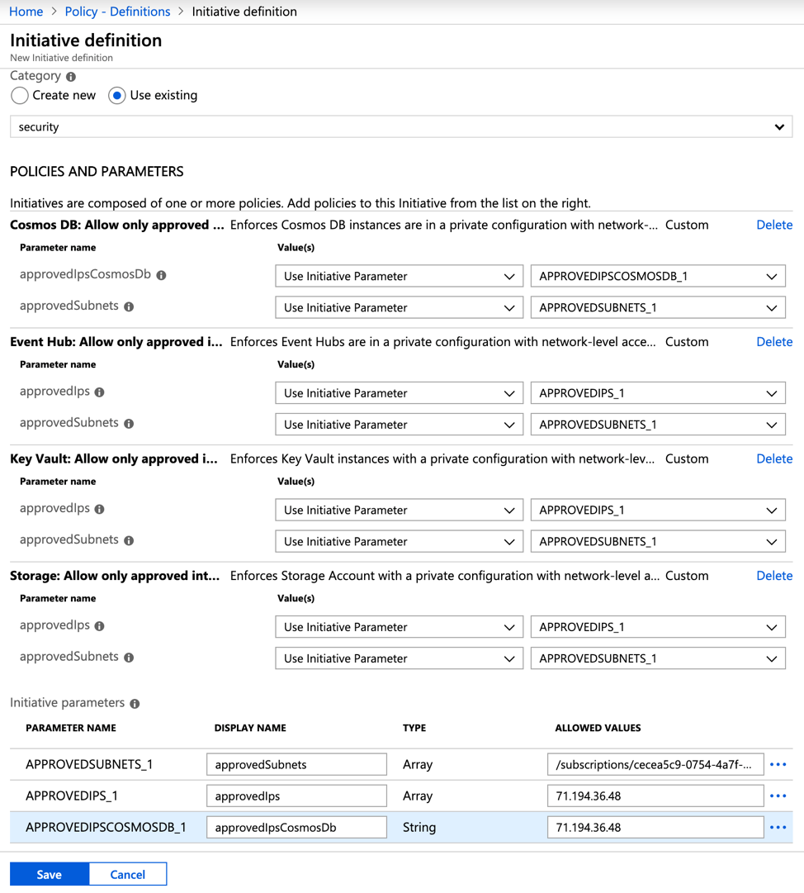
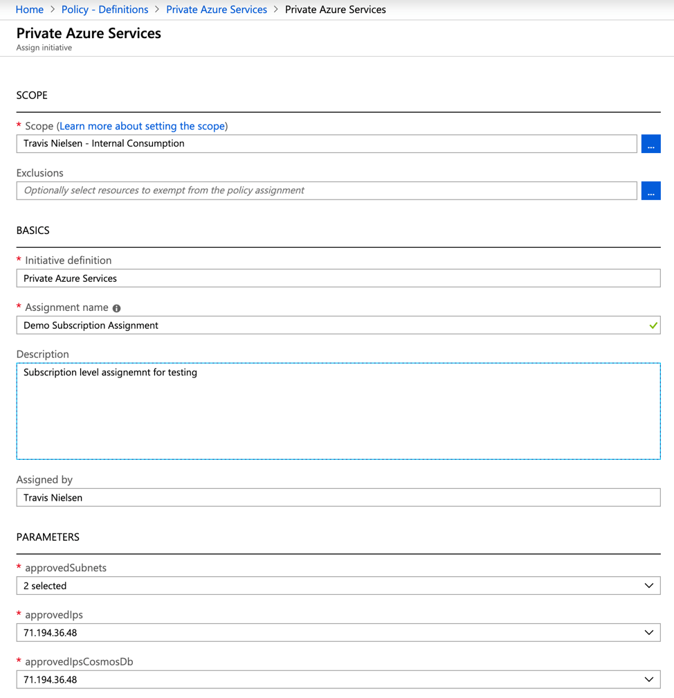
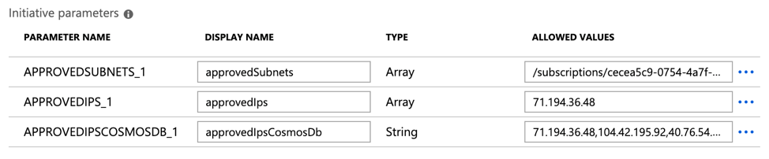
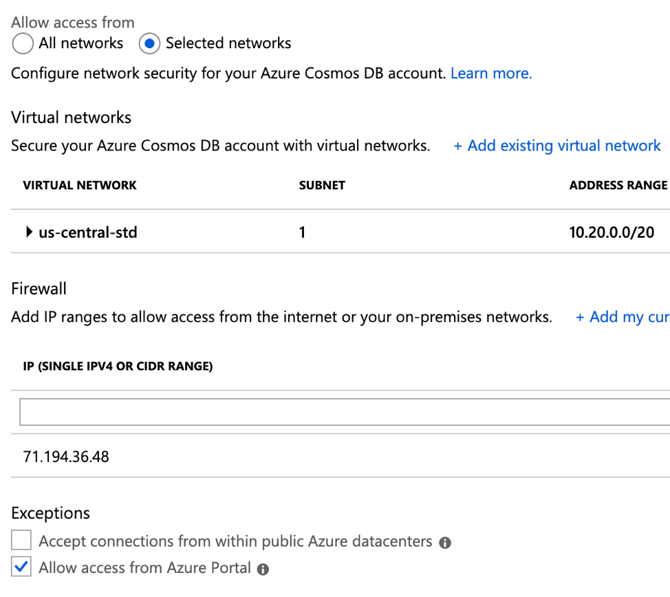

# Azure Policies

Overivew TBD

## Deployment

Open a terminal session, authenticate to Azure, and use the `create-policies.sh` file to create each policy in Azure.  Next, create an Initiative and add each policy you wish to have inlcuded. Initiatives allow you to delegate each policy's input parameters to an Initiative parameter, which greatly simplifies management.

Finally, assign the initiative to a subscription. For networking policies, this is where you will manage approved subnets and whitelisted IP ranges.

**NOTE:** Cosmos DB IP whitelisting works a bit differently than other services. In the `approvedIpsCosmosDb` Initiative parameter, you will need to enter a comma-separated list of your custom IPs followed by the Azure portal IP ranges documented [here](https://docs.microsoft.com/en-us/azure/cosmos-db/how-to-configure-firewall#allow-requests-from-the-azure-portal). This example illustrates setting a single custom IP and the Azure portal addresses.

Users will need to ensure the full list of whitelisted IP addresses are set in additon to checking the "Allow accesss from Azure Portal" checkbox.

